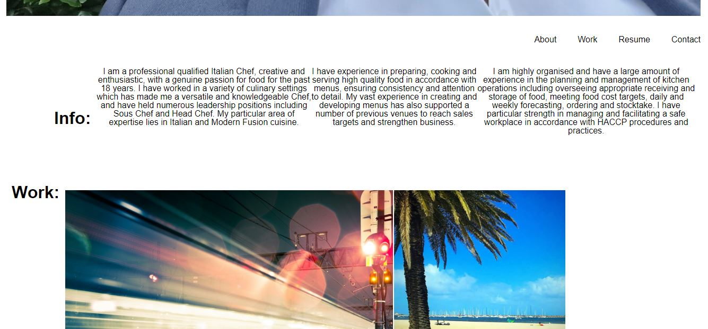

# Port-Folio-Demo
## Work in progress..

This is my first Portfolio Project.

A portfolio of work can showcase my skills and talents to employers looking to fill a part-time or full-time position. An effective portfolio highlights my strongest work as well as the thought processes behind it. Most who have portfolios with deployed web applications (meaning they are live on the web) are typically very successful in their career search after the boot camp. This last point can't be stressed enough: having several deployed projects is a minimum requirement to receive an initial interview at many companies.

I am still building this project to better understand the use of applying the core skills I've recently learned: flexbox, media queries, and CSS variables.

I have learned a lot of new things, but sometimes gets tricky to put them together.


 - [For a full web description of the Port-Folio-Demo](https://bonda3vaax.github.io/Horiseon-Project/)
 - [For a full github description of the Port-Folio-Demo](https://github.com/Bonda3Vaax/Horiseon-Project.git)

# Features

```
GIVEN I need to sample a potential employee's previous work
WHEN I load their portfolio
THEN I am presented with the developer's name, a recent photo or avatar, and links to sections about them, their work, and how to contact them
WHEN I click one of the links in the navigation
THEN the UI scrolls to the corresponding section
WHEN I click on the link to the section about their work
THEN the UI scrolls to a section with titled images of the developer's applications
WHEN I am presented with the developer's first application
THEN that application's image should be larger in size than the others
WHEN I click on the images of the applications
THEN I am taken to that deployed application
WHEN I resize the page or view the site on various screens and devices
THEN I am presented with a responsive layout that adapts to my viewport
```

## Mock-Up

The following image shows the web application's appearance and functionality:


## Requirements 

This project requires:

  - Visual Studio Code
  
  - Chrome Browser

## Installation

Port-Folio-Demo requires Visual Studio Code and Chrome Browser in this case, to be installed.   

- [Visual Studio Code](https://code.visualstudio.com/Download)

- [Chrome](https://https://www.google.com.au/chrome/?brand=YTUH&gclid=Cj0KCQjwspKUBhCvARIsAB2IYut5nZcv5KdxSPEM-jChArgYIusCGWIY69hokwFpE1uWWRiR1NGNl4gaAmrbEALw_wcB&gclsrc=aw.ds)

## How to use

 - Open Visual Studio, click Explorer, add folder to workspace for code inspection, additional modifications, debugging, and visualization in default browser.
 
 - Open index.html in default browser for visualization and inspection by pressing the F12 key.

## Project Status

To be reviewd by the Centralised Grading Team. 


## Faq

Q: How do I access Horiseon-Project?

A: By copying the following Url into your default Browser, https://bonda3vaax.github.io/Horiseon-Project/, followed by Enter key.

## Author

 - Andrei Bondaret

## Acknowledgements

 
 - [Visual Studio Code](https://code.visualstudio.com/)
 - [Chrome](https://google.com)